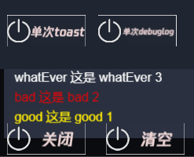

# 游戏内log功能

游戏内log功能在游戏中设置了一个UI直接在上面打出log，不需要再特定的平台下查看log

## 可用操作

- 当设置**isUsed**为**false**时，启动后自动关闭该功能
```typescript
    @property({
        tooltip: '是否启用该功能；仅仅在开发阶段打开',
    })
    isUsed: boolean = true;
```

## 简单示例

```typescript
SystemDebugLog.instance.addInfo(logLve.good, '需要输出log1','需要输出log2');
```
- **可能的疑惑** [logLve.good 是什么？](./../enum/logLve.md) 

## 测试用例
- 用例1
  - 反复调用 **addInfo** 接口
- 预期效果
   - UI面板中正确显示调用中输入的字符串,最后输出的在顶部
- 测试截图
  - 
  
- 用例2
  - 点击**清空**按钮，清空已有log
  - 点击**关闭**按钮，关闭整个功能