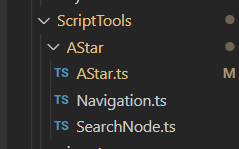
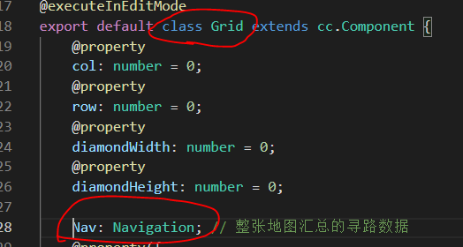
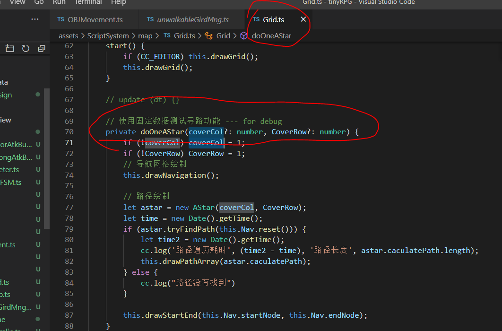
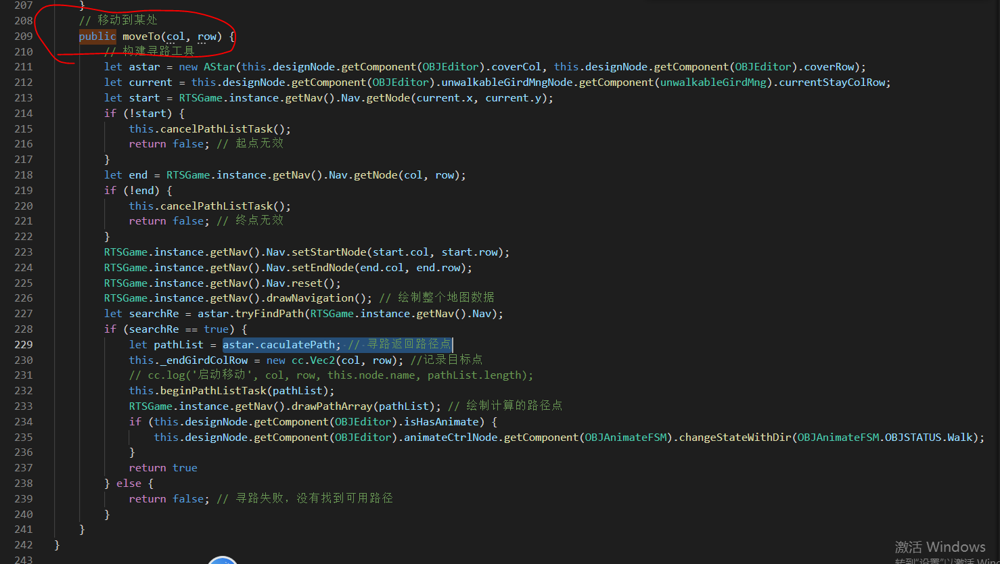

# astar 寻路模块

寻路模块由一下几个子系统构成
- 
  
- [搜索节点数据 SearchNode](./SearchNode.md)
  - 描述了一个路径点的信息
- [搜索主逻辑 AStar](./AStar.md)
  - 寻路的主逻辑，通过导航信息，计算路径
- [导航信息 Navigation](./Navigation.md)
  - 记录了地图中的所有路径信息（那些格子可以走，那些不能走）为寻路提供地图数据

## 如何使用

- 1,每个 gird 组件都有一个 Nav: Navigation 属性。不论这个gird是用做整个地图的网格还是某个游戏对象的设计区域网格。如下图
  - 
  - 所以第一步是获取地图的导航数据，这步已经贴心的由全局组件为你服务。
  - 在游戏内使用如下代码可以获得地图的导航数据
    ```ts
    RTSGame.instance.getNav().Nav
    ```
- 2,接下来是正式开始寻路，寻路的第一步是设置路径的起点和终点
    ```ts
    RTSGame.instance.getNav().Nav.setStartNode(start.col, start.row);
    RTSGame.instance.getNav().Nav.setEndNode(end.col, end.row);
    ```
- 3，然后是重置寻路的数据,重置数据的操作可能在其他地方使用寻路完成的时候会重置一次，但是这里依旧重置，保证一定不会有问题
    ```ts
    RTSGame.instance.getNav().Nav.reset();
    ```
- 4，接下来是构建 astar 寻路工具。传入的参数是游戏对象的网格宽高，因为一个2X2的游戏对象，需要一条能够容纳2X2面积的通路
  ```ts
  let astar = new AStar(this.designNode.getComponent(OBJEditor).coverCol, this.designNode.getComponent(OBJEditor).coverRow);
  ```
- 5，进行寻路运算。寻路运算会返回一个 bool 值，为 true 时认为这是一次正常的寻路计算，反之则是失败。失败的原因可能是，终点起点在无效区域，路径封闭无法抵达等等
  ```ts
    let searchRe = astar.tryFindPath(RTSGame.instance.getNav().Nav);
  ```
- 6，如果返回成功，则可以读取路径点。到此为止路径的计算就完成了
  ```ts
  astar.caculatePath; // 寻路返回路径点
  ```

  ## 具体应用

  - 1，请参考 gird 组件自带的寻路调试函数
    - 
  - 2，亦可参考 [游戏对象移动示例](../obj/OBJMovement.md) 中的移动部分代码
    - 