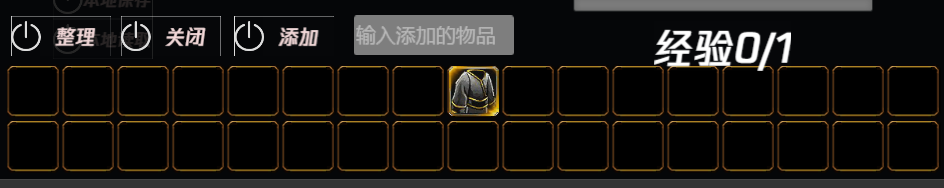
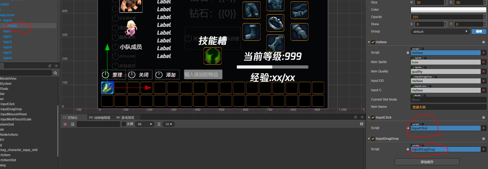
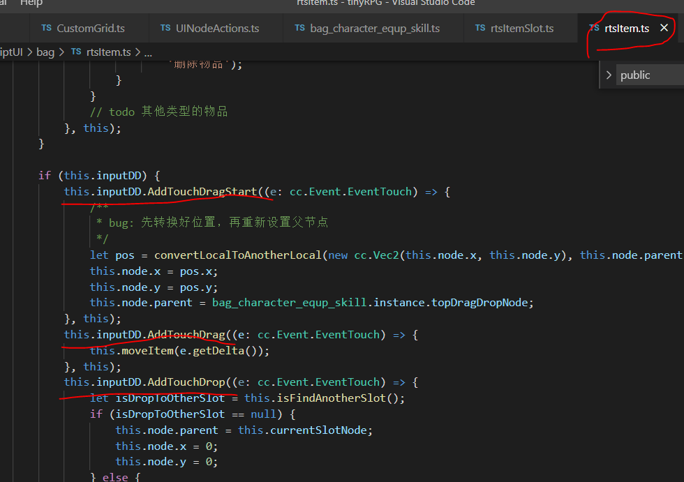
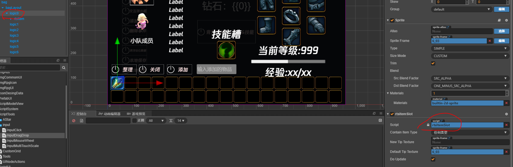
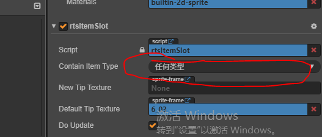
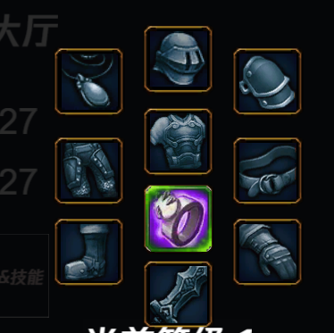
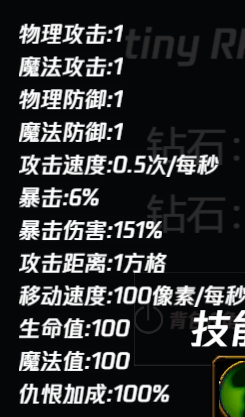
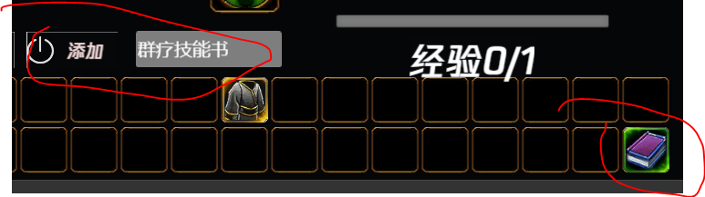
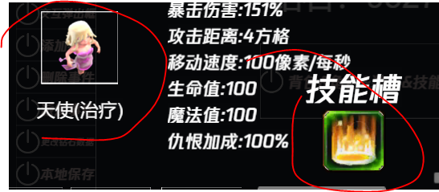
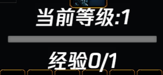

# 背包综合界面

整合了 **角色，装备，技能，背包，属性，经验等级** 6个综合功能。

## 对外接口

- onItemDrapDrop() 界面内发生物品的拖拽放置后，更新逻辑
- buildSkill(cType: CharacterType) 构建 [对应玩家类型](../enum/CharacterType.md) 已经学习的技能
- forgetSkill(skillName: string) 遗忘当前选中角色的技能
- deleteItemInBag(posIndex: number) 按所属位置，删除背包物品

上述对外借口是其他模块需要调用的全部接口。当然对于背包综合界面的功能仅仅了解这些还不够，下面分类详细介绍

**注意** 介绍时不会逐条介绍各个系统的每行代码怎么写的，换做提出几个重点的问题，作为线索。然后再请自行阅读代码。这样我们都省心

### 背包

- 

- 问题1，物品如何在格子之间的拖拽放置？
  - 1，拖拽
    - 要回答这个问题，就需要引出项目中如何处理 玩家输入 ，也就是玩家 [单击，双击，拖拽，双指缩放，鼠标滚轮](../playerInput/index.md)
    - 解决上面的问题，回答这个问题就简单了
    - 首先物品 node 上添加了 InputDragDrop 组件，可以处理拖拽输入
      - 
    - 其次物品处理脚本，监听并处理了拖拽事件的逻辑，让节点可以移动
      - 
    - 如果你足够细心则会发现，处理 **点击** 的输入方式和拖拽大同小异，往后将不在赘述 **点击**输入
  - 2，放置
    - 光能将 node 到处拖拽还不算完成了背包的功能，拖拽出去的节点需要能够知道 node 丢下的地方能不能成为新的放置点
    - 下面就需要第二个脚本 rtsItemSlot , 如果一个 node 放置了这个脚本，那么这个 node 的区域，将作为可能的一个放置物品的区域
      - 
    - 每次拖拽结束，程序会在可能出现的放置点搜寻持有 rtsItemSlot 脚本的节点，并且判断这个区域释放能够成为合法的放置点（区域重叠检测，放置规则检测）
  
- 问题2，我设置了一个放置点，我怎么让他只能放置特定类型的物品？
  - rtsItemSlot 面板上设计了一个可选项，设置该选项可以限制可放置的[物品类型](../enum/itemType.md)
    - 

- 问题3，我想测试下特定的物品，该怎么获得该物品
  - 背包加入了添加任何物品的调试功能，输入想要的物品名字，点击**添加**按钮，则可获得对应物品
  - 

### 装备

- 
  
装备栏只是一组特殊的背包格子，下面简述装备栏和普通背包的区别

- 主要的区别有一个
  - 1，装备栏只允许放置 **装备类型** 的物品，这一点在背包的 问题2 中介绍了

### 角色

- 

- 内置了三个角色，坦克，治疗，和远程物理输出，点击icon可切换对应的装备，技能，属性，经验等级界面

### 属性

- 

- 面板属性来自两部分，1是等级提供的固定属性成长，2是装备提供的装备属性
- **需要注意**的是，在战斗过程中，玩家获得的buff和debuff，是不会显示在 UI 的属性面板上的。只会在战斗中动态运算

### 技能

- 

- 技能槽目前一个角色只有一个，但是在代码实现上是支持多个技能槽的，可随时添加
- 当在背包中获取到技能书时，通过拖拽放置到技能槽上可以习得该技能。
- 点击已经习得的技能可以遗忘技能以重新学习新技能
- 当把技能书拖拽到已经习得的技能的技能槽时，会自动遗忘旧技能，学习新技能
- [更多关于学习技能和习得的技能的释放移步到](../learnSkill/index.md)

- 
- 
  
### 经验等级

- 经验等级顾名思义。在战斗过程中通过击杀怪物，获得经验奖励，提升等级
- 