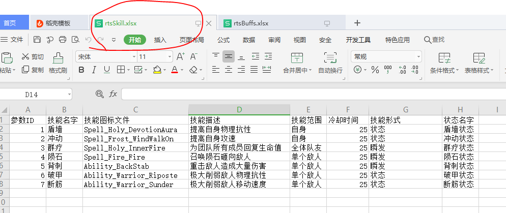
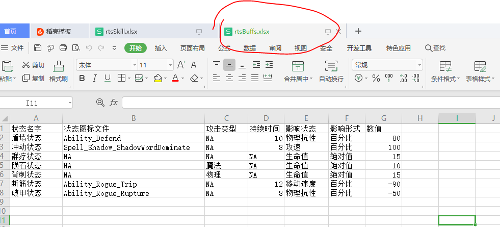

# buff 系统

buff 指的是在战斗过程中获得的对游戏对象熟悉造成影响的状态。

## 关于 buff

当释放效果是 buff 的技能释放时（可能是玩家释放也可能时怪物），你有可能获得buff。由此可知buff跟技能息息相关。
下面两张截图分别时技能表和技能表对应的buff表
- 
- 

由表中可知。一个技能会对应一个buff。需要注意的是。技能分瞬发和給buff。所以buff表中也会记录固定伤害的数据，并不全是buff数据

## 示例

- 请阅读
- [技能释放示例](../learnSkill/index.md)