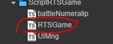

# 游戏对象查询及其地图中行列和像素坐标互相转换

组件为全局单例组件，处理整个项目中对于地图坐标和地图中的游戏对象的查询相关操作

- 如果在游戏中你想再地图中把对象的 行列和像素坐标互相转换 
- 如果在游戏中你想查找跟对象相关的信息，比如，查询你的队友，查询周围是否有敌人等
- 
## 对外接口

- 坐标相关
  - getNav() 返回世界网格
  - convertGirdColRowToPos(col, row, node: cc.Node) 将 行列 >> 坐标
  - convertPosToGirdColRow(node: cc.Node) 将 坐标 >> 行列
- 对象相关
  - isInColRow(col, row, node: cc.Node) 检查 对象是否 完全进入 格子
  - findCtypeOBJ(ctype: CharacterType) 查询特定 [CharacterType](../enum/CharacterType.md) 对象
  - findAllRedTeam() 查询所有 红队 队友
  - tryFindObjOnGird(gird: cc.Vec2) 查询一个行列点上有没有游戏对象
  - tryFindObjOnPoint(point: cc.Vec2) 查询一个点上有没有游戏对象
  - isAnyEnemyInDistance(objNode: cc.Node, distance: number) 以对象为中心一定区域内 是否有敌对目标

  