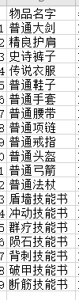
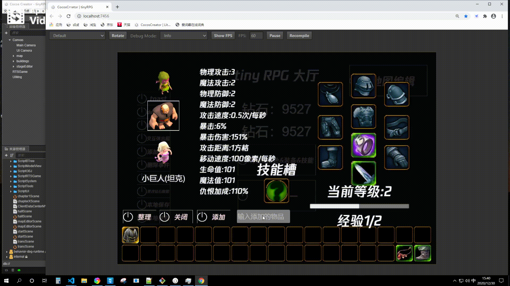

# 通过学习获得的技能

每个玩家控制的游戏对象都有一个默认技能，比如 巨人 是近战的物理普通，天使 是远程魔法治疗。除了默认的技能，游戏对象还可以通过技能书学习新的技能。目前每个玩家的游戏对象开放了一个技能插槽（设计上可以开放多个）。

- 1，获得技能书
  - 通过下图中已有的策划物品表单选择一个技能书添加 [如何在背包中添加物品](../bag_character_equp_skill/index.md)
  - 
  - 本次选择 盾墙技能书 
  - 添加后效果，在背包中找到技能书，拖拽到技能槽。
  - 
  - 现在 巨人 角色获得了 盾墙技能。
- 2，技能的释放
  - 现在进入游戏。当单击 游戏场景中的 巨人 游戏对象时，左下角处你能发现新学会的技能。
  - 点击释放技能。由于盾墙是个 buff 效果。你能在左上角发下新增的技能
  -  