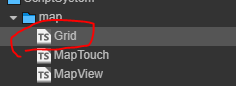
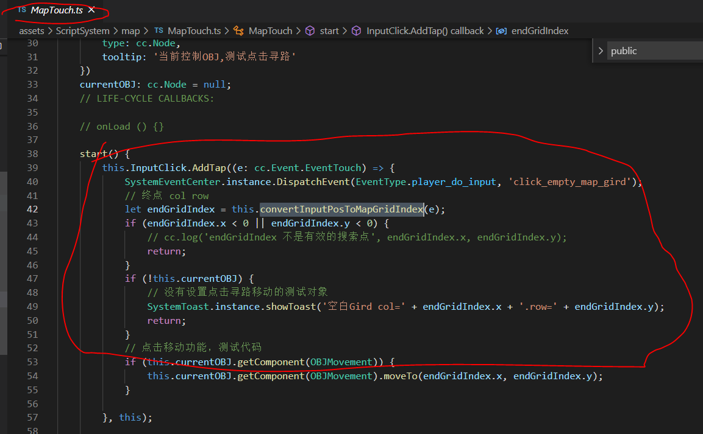
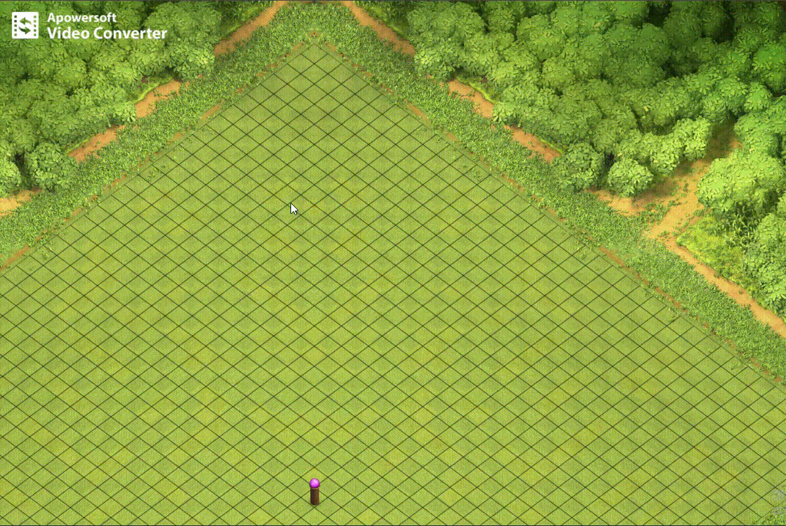

# 网格构造器

网格构造器在项目中有两个重要的作用
- 1，使用在描述地图的属性
  - 描述地图的长宽，以及一个小格子的长宽。前者决定了地图的大小，后者决定了地图的密度
- 2，使用在描述游戏对象的区域
  - 描述了一个游戏对象需要占用多大的区域。

- 脚本在哪
  - 

## 外部接口

- 辅助线绘制接口
  - cleanDraw() 清除绘制
  - drawNavigation() 绘制网格信息（绘制所有可行走点及其不可行走点）
  - drawGridList(list: cc.Vec2[], color: cc.Color = new cc.Color(0, 0, 255, 100)) 绘制传入的坐标数组
  - drawPathArray(arr: Array<SearchNode>) 绘制传入的 SearchNode 数组 [什么是 SearchNode](../astar/SearchNode.md)
  - drawGrid() 绘制整个网格
  - fillAllGrid(color?: cc.Color) 填充整个网格
  - fillGrid(from: cc.Vec2, to: cc.Vec2, color?: cc.Color) 填充传入的网格区域
- 下面是实际功能的接口
  - getDiamondColRow(p: cc.Vec2, diamondWidth: number, diamondHeight: number) 网格节点的本地坐标转换为网格的col row
  - getDiamondTopPoint(col: number, row: number, diamondWidth: number, diamondHeight: number) 给定网格的col row ，返回网格中目标菱形的顶点坐标

### getDiamondColRow 接口测试用例

- 下图中的 convertInputPosToMapGridIndex 接口，通过调用 getDiamondColRow 获得网格行列坐标
- 

### getDiamondColRow 调用效果

- 