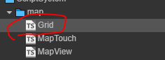
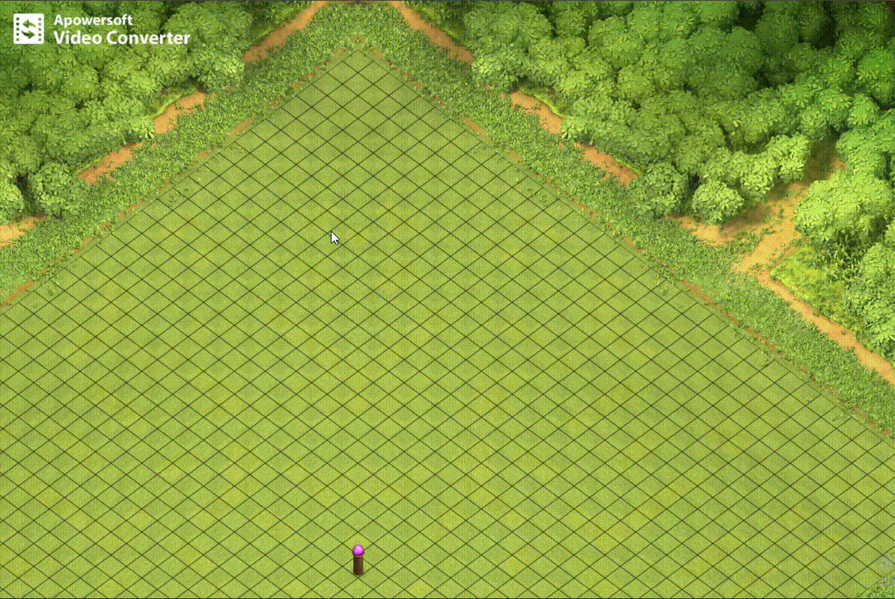

# 地图单击输入组件 MapTouch

组件处理了玩家对地图进行单击操作的逻辑。
- 脚本在哪，不在重复截图和 gird 在一起
  - 

## 外部接口

- convertInputPosToMapGridIndex(e: cc.Event.EventTouch)  将一次触碰或者点击的位置转换为网格地图中的坐标
- convertInputPosToWorldPos(e: cc.Event.EventTouch) 将一次触碰或者点击的位置转换为网格地图中的坐标

- 为什么会有这两个接口? 
  - 在 [地图视角组件](./MapView.md) 中地图可以随玩家操作进行视角的上下左右平移或者高低的缩放。所以无法从任何一次点击中直接换算出地图上的具体坐标
  - 通过这两个接口可以方便的从一次点击中获得在地图网格上的 像素坐标 或者 网格宽高索引

## 测试用例，这里沿用了 gird 的同一用例

- 
- 