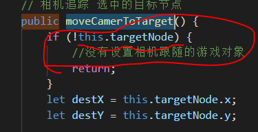

# 地图视角组件 MapView

该组件处理了地图视图的 平移 缩放 和视角追踪功能
- 脚本在哪，不在重复截图和 gird 在一起
  - 

## 外部接口

- 地图视角的变化全部由脚本内部完成，只外放了一个接口
  - moveCamerToTarget() 相机追踪 选中的目标节点
  - 

## 视角控制效果预览

- 

## 相机追踪用例

- 沿用 [对象移动中的例子](../obj/OBJMovement.md)