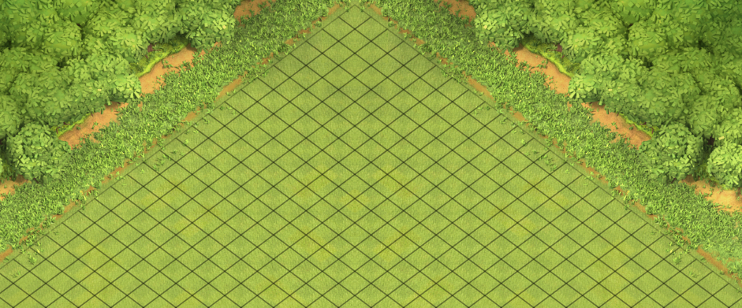

# 地图模块

地图模块决定了，场景中的游戏对象移动的范围和移动寻路的方式，并为游戏对象提供地图相关的接口
- 

- 地图的实现
  - 地图使用 2.5d 的菱形网格构图，区别于一般的 2d 网格，网格中的方格为菱形而非正方形。
- 其中地图模块由三个脚本组件构成
  * [菱形网格组件 grid](Grid.md)
  * [地图输入组件 MapTouch](MapTouch.md)
  * [地图视角组件 MapView](MapView.md)
