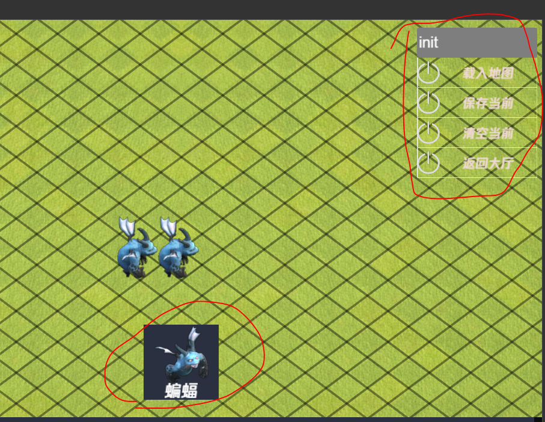

# 地图编辑和读取

地图的编辑由专门的 mapEditorScene 场景管理。比起真正的进行游戏章节场景。编辑场景简化了部分功能，比如去除了 buff系统，技能系统，背包综合界面等。而且添加到编辑场景中的所有游戏对象将被锁定，即不移动不战斗不交互。只作为示意占据场景中的位置。

## 场景中提供了如下功能

- 
- 添加
  - 通过拖拽图中提供的怪物按钮，向场景中添加一个游戏对象。此处仅仅有一个 蝙蝠 作为示例，建筑或者障碍物同理
- 保存
  - 保存在 web 环境下点击保存将会收集场景中已有的游戏对象，并将其用 json 格式保存下载。
- 清除
  - 清除当前场景下的所有游戏对象
- 载入
  - 根据文件名字载入已经编辑好的场景数据

## 完整示例如下：

- 
