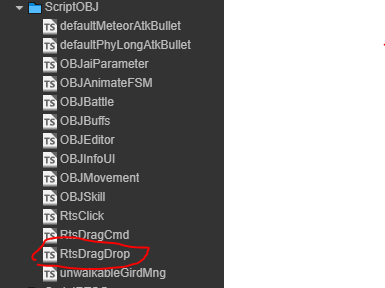

# 动画控制组件

管理了游戏对象的动画，播放什么动画，播放朝向哪里动画
**需要注意的是** 组件通过一个消息的有限状态机控制状态以达到播放对应状态的动画的功能。

- 游戏对象 相关的代码都在一窝，不在挨个截图了
- 

## 外部接口

- getAnimateDuringTime(animateState: string) 获取动画的播放时长
- changeStateWithDir(newState: string) 切换播放的动画
- changeDirOnly(newDir: DIRECTION) 仅切换动画的方向

## 简单示例

- 示例以 '巨人' 的动作作为例子，介绍了如何让游戏对象具有动作
- **注意** 本例子是作为 [游戏对象总体设计](./OBJEditor.md) --> [游戏对象的移动](./OBJMovement.md) 两个例子的后续

- 1,关闭 原先添加的 OBJStaticBody 节点，再添加 OBJAnimateBody 动画预制体。**还需注意**的是 ‘巨人’ 的美术设计是占 2X2 的格子区域的需要调整 editor 的设计区域为 2X2 。然后调整 OBJStaticBody 节点的位置，使其表现效果在设计区域的中心。
  - 
  - 
- 2，操作 editor ，添加动画功能，将设计好的动作 clip 拖拽到对应的位置。如下图：
  - 
  - 
- 3，到此为止，动画组件已经设置完成，游戏对象已经具有动画。是不是很简单

## 预览效果

- 