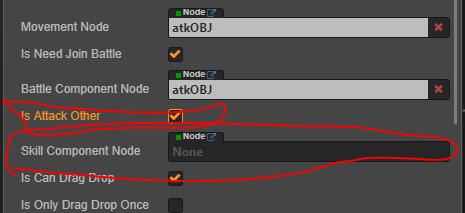

# 参与战斗

赋予游戏对象参与战斗的能力。**注意** 参与战斗有两个含义，1，是能够挨打。2，是能够打别人。如果挂载了这个组件，意味着一定具有了挨打的能力，至于能够打别人。还要额外的设置。不要混淆了
- 游戏对象 相关的代码都在一窝，不在挨个截图了
- 
  
## 外部接口

- setProperty(prop: propertyGroup) 设置属性
- HateUpdate(sourceNode: cc.Node, damage: number) 仇恨更新
- HPUpdate(dt: number, atkSource: cc.Node) 血量更新
- OBJDead() 死亡
- isHasTarget() 是否已经设置了目标
- setTarget(node: cc.Node) 设置目标
- releaseTarget() 取消目标
- deleteSkillCastTimeCounter(type: OBJSkillTYPE) 移除一类已经存在的技能倒计时 [什么是 OBJSkillTYPE](../enum/OBJSkillTYPE.md)

## 具体使用

- 由于 battle 组件较为复杂，我们使用一边使用一边介绍方法，逐步描述战斗的功能

- 1，如下图添加 battle 脚本组件。并做如图的设置。**注意**该示例是 [游戏对象总体设计](./OBJEditor.md) 中示例的后续，保证已经先行阅读。
  - 
  - 逐一介绍下 inspector 上的属性意义
  - 1，belong team 是游戏对象所属的阵营，[阵营有哪些](../enum/BattleTeam.md)
    - 不同的阵营还需要设置额外的属性
    - 1，中立，设置为中立意味着要同时和红队蓝队作战。不需要额外设置什么
    - 2，红队，设置为红队时，需要额外设置游戏对象的 [玩家类型](../enum/CharacterType.md)
    - 3, 蓝队，设置为蓝队时，需要额外设置 monster name。
      - **什么是 monster name** monster name 是策划表中怪物表的一栏，描述的是怪物的名字.用于读取怪物的策划表
      - 
  - 2，design node 这是个常用的属性，指的是 editor 所在的节点
  - 3，buff node 指的是对象 buff 管理节点
  - 4，isAutoPickDamageSourceAsTarget 指的是当对象受到攻击而又没有选择任何对象将自动选中发起攻击的对象
  - 5，isUesHateSystemToRepickTarget 在战斗中在一次攻击发起时是否选择使用 **仇恨系统** 重新选择仇恨值最高的对象进行攻击
  - 6，接下来从 current hp 到 hate 的属性都是游戏对象的[战斗属性](../functionClass/propertyGroup.md)
  - 7，default atk type 是指的游戏对象的默认攻击类型
  - 8，atk range check 是一个调试功能，不具有逻辑意义，点击后会显示配置的攻击范围 
- 2，由上述可知，要想测试战斗功能，我们需要至少两个能够参与战斗游戏对象且至少一个可以进行攻击其他对象且两个对象隶属不同阵营。
- 3，那么现在我们添加一个只能参与战斗的靶标游戏对象。
  - 额外添加一个 battle 组件。如下图：
  - 
  - 那么现在我们就拥有了一个，可拖拽的，可参与战斗，但是不可以攻击的，中立阵营的沙包游戏对象
- 4，接下来我们添加一个可以攻击其他对象的游戏对象。由于攻击对象需要匹配对应动作所以接下的操作是 [动画控制组件](./OBJAnimateFSM.md) 的后续
  - 按如图添加战斗组件，配置为红色阵营，默认攻击类型为近战普攻
  - 
  - 接着在如图的地方，勾选 is attack other 选项。这个操作的意义是让对象具有攻击其他目标的能力
  - 
  - 可以看到勾选上之后，多出了 skill compoment node 选项，这个是对象的[技能释放组件](./OBJSkill.md)。再按下图添加：
  - 
  - 可以看到 skill compoment 组件上空出了需多预制体的位置，这些位置是需要释放出子弹（弓箭，陨石，都叫子弹）的技能需要的，这里我们配置的是近战普攻不需要释放出子弹，可以不管。
  - 那么现在这个对象就具有了攻击其他对象的能力。是不是很简单
  - 5，现在启动游戏，发现游戏中两个对象并没有发生攻击或者被攻击的情况。这是因为，并没有谁向游戏对象下达攻击某个目标的指令。所以现在我们要接着处理这个问题。不要害怕麻烦，已经走到这一步了，离成功只差一步之遥。信我
  - 6，添加 [对象拖拽指令控制组件](./RtsDragCmd.md)，分两步，1，是添加 rtsdragcmd 组件2，是添加箭头图片节点(关于设置 sprite 的拉伸设置属于引擎的基础功能这里不在赘述)，如下图操作
    - 
    - 
    - 这个实例是继承的 [动画控制组件](./OBJAnimateFSM.md) 而**动画控制组件示例**又是是继承自 [游戏对象总体设计](./OBJEditor.md) --> [游戏对象的移动](./OBJMovement.md) 两个例子。所以现在这个巨人的对象再地图中是和沙包对象一样是可以拖拽的，添加上这个拖拽指令组件后，细心的你肯定发现拖拽移动和拖拽输入指令这两个功能似乎是冲突的，但是再设置 editor 组件的时候根本没有给出我任何提示。下面介绍 editor 组件的另一个辅助功能如下图：
    - 
    - 点击该勾选项可以在 creator 的 log 输入框中输出该游戏对象的设计信息，下图中展示了本对象的设计信息。其中有两个红色报错。1，就是说的拖拽移动和拖拽指令两个功能冲突。2，是说的没有设置 buff 组件的问题，当然这个例子依旧没有涉及 buff 功能。可以暂时不管它。
    - 
    - 为了处理这个问题，我们把拖拽组件 rtsdragdrop 删除,并在 editor 上去除勾选的拖拽属性。重新启动游戏。当再次对巨人对象输入拖拽操作的时候，发现可以拉出一个箭头，箭头指向空白区域会走向该区域，指向敌人会执行选中并攻击敌人，效果如下：
    - 
  - 7，值得高兴的是从效果上来看，巨人对象在对着沙包对象疯狂输出,战斗的功能已经完成。但是作为玩家，我即不知道每次攻击造成了多少伤害，也不知道沙包还剩下对少 hp。下面我们在引入一个跟战斗相关的组件 [游戏对象头顶UI信息](./OBJInfoUI.md)
    - 为沙包对象添加，**游戏对象头顶UI信息**，如下图操作:1,添加组件代码2，是添加 UI 信息节点3，在 editor 上勾选对应功能
    - 
    - 
    - 再次启动游戏，发现攻击时，沙包对象会出现一个记录 hp 的血条，并随攻击慢慢减少
  - 8，现在再处理每次攻击没有伤害显示的问题。操作很简单，只需勾选 is need battle number... 这个选项
    - 
    - 再次启动游戏攻击时会弹出伤害数字
  - 9，到此位置本例的所有内容都已结束，但是关于战斗相关的内容还要很多，比如 buff模块，近战普通之外的的默认技能，[通过学习使用的技能](../learnSkill/index.md)等等，这些功能请接着阅读文档的对应篇章。

### 本例完整预览

- 