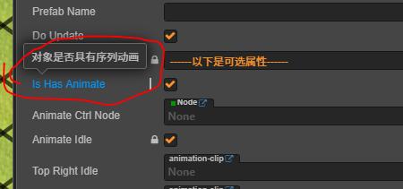

# 游戏对象总体设计

这个组件是描述一个游戏对象顶层控制脚本，一个游戏对象需要添加什么功能均通过此脚本管控和添加
- 

## 外部接口

- isLocked() 是否锁定
- unlockOBJ() 解除锁定
- lockOBJ() 锁定对象
- releaseDragDrop() 释放拖拽操作
- addDragDropFunc() 添加拖拽功能

## 那么应该怎么在面板上操作让一个普通的节点成为一个游戏对象并且具有一定功能？ 下面以创建一个最基本的游戏对象为例展示操作流程

- 1，在地图中的 OBJS 根节点创建一个普通 node 节点，并且添加该脚本
  - 
- 2，然后可以在脚本的 inspector 面板上看见可操作的选项
  - 
  - 图中框住的部分提示为 '必须填写的属性'。
  - 1 **cover col,cover row** 为对象占据的格子区域，图中 1,1 意味着占据1个格子，2，2表示占据 2X2 四个格子.随你填写例子中使用 1X1
  - 2 **Grid** 为设计辅助网格脚本，这是为了在设计时能可视化的看见自己设计的样式。 [什么是 Grid](../map/Grid.md)
    - 设置这个属性按如下这么操作
      - 1，找到预制体
      - 
      - 2，将预制体添加到正在设计的节点下
      - 3，将添加的预制体挂载在 editor 脚本的 grid 属性下。
      - 最后如下图
      - 
    - 最后不是说是**设计辅助网格脚本**么，怎么让它辅助我一把呢？
      - 点击图中的按钮
      - 
      - 你能得到如下图中的辅助，设计的格子区域被绿色色块填充
      - 
- 3 接下来的三个选项**两个 current 什么东西的和一个 is cover 什么**，这三个带有一个白色小锁，这意味着只能看不能操作。所以不用管
- 4 **unwalkable 什么的** 这个你按下面操作挂上脚本即可。 [我非要现在弄明白 unwalkableGirdMng 是什么](./unwalkableGirdMng.md)
  - 
- 5 **prefab name** 这个属性是你这个预制体的的文件名字，肯定是有地方有用。但是现在才哪到哪，空着不填
- 6 到此位置，所有的必须设置项我们都设置过了，现在这个节点就是一个合格的游戏对象了。但是现在运行游戏，场景中一片空白，很难想象刚刚我设计了一个游戏对象。那么向下看
  
## 让游戏对象有图像

- 如图再添加一个预制体 **OBJStaticBody** ，这是一个静态展示的图片，肯定还有带动作的，不过这里你是看不到了。
  - 
- 将 **OBJStaticBody** 的精灵添加一张贴图.你可以调整 **OBJStaticBody** 的坐标，使其处在设计区域的合适位置
  - 
- 再次启动游戏你就可以看到你设计的游戏对象了

## 看了半天你就给我看这？费了这么大力气，这效果跟我直接添加一个精灵有什么区别。别急那么让我们更进一步添加一个有用的功能

- 让游戏对象可以拖拽
  - 1，刚才处理了**必须填写的属性**，下面我们看看**非必须填的属性**。
  - 2，下拉 inspector 能看到需要设置的属性繁多。但不要害怕，我们先只关注 能够打勾的 bool 类型的属性。如下图：
    - 
  - 3，将鼠标放在 属性 上可以看到弹出的简要描述。我们就一路看下去。将我们不需要的属性勾选为 false
    - 
  - 4，一顿操作之后可选的选项不多了
    - 最后之剩下如图的一项属性，这便是预留的 **可拖拽** 功能
    - 
  - 5，下面为该功能添加对应的功能代码
    - 控制对象拖拽操作的代码组件为 [RtsDragDrop](./RtsDragDrop.md)
    - **注意** 关于在游戏对象中 inputdragdrop 组件添加在哪里的问题。1，如果你是个单张图片的静态对象，加在 editor 所在的node上，组件大家都在一起。2，如果是在动作的对象，加在动画的 OBJAnimateBody 上。其实我很想都加在 editor 上但是这个偷来的美术尺寸用的很不好，引起了这个问题。不过问题不大
    - 
    - 最后我们的属性 inspector 面板是这样的
    - 
- 现在启动游戏看下你是否可以拖拽了。
- **注意**：如果不能你可能要停下好好梳理一下，因为所有游戏对象的其他更为复杂的功能都是通过这个流程添加的。错过这里可能后面对你的困扰更大。还是我来帮你梳理下把；
  - 这个简单的拖拽功能使用了 [玩家输入中的 拖拽功能](../playerInput/InputDragDrop.md) 看下拖拽功能里面的注意你是是不是漏了什么，比如把 node 的 size 大小设置为了 0，0。
  - 拖拽功能还设置了只允许拖拽一次的选项。如果你拖拽了一次就无法再次拖拽了，看下是不是勾选了这个选项
  - 如果还不行，请仔细核对你的步骤，反正我是行了

## 最终效果

- 

## 最后留给你自己探索了

- 如图设置，重新启动游戏看下有什么不同.
  - 
- 还是我来告诉你吧。如果勾选这个选项，放置后，刚刚我们设计的游戏对象区域会变暗。如果不勾选则不会。变暗意味着设个区域内无法被寻路