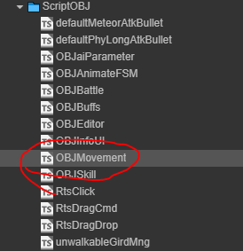
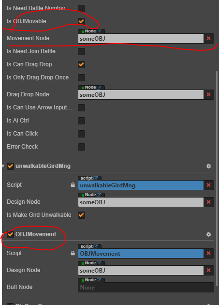
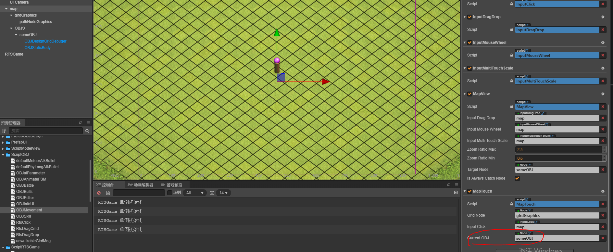
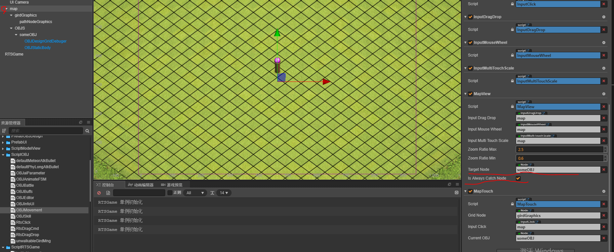

# 游戏对象的移动

该组件赋予游戏对象移动的功能

- 

## 外部接口

- setMoveSpeed(speed: number) 设置移动速度
- isNeedMovingUpdate() 是否正在更新移动
- getMoveEndGird() 获取终点
- cancelPathListTask() 取消移动
- pathCheck(col, row) 跟 moveTo 几乎一样 只是不执行移动，只检查路径是否有效
- moveTo(col, row) 移动到某处

## 简单示例

- 示例简单展示了如何添加该组件，让组件获得移动的能力；**注意**该示例是 [游戏对象总体设计](./OBJEditor.md) 中示例的后续，保证已经先行阅读。

- 1，添加组件代码
  - 如图操作，开启游戏对象设计组件的移动功能，并添加代码组件。**注意** movement 组件上有个 buff node 是空着，是因为移动的速度可能受到 buff 影响。但是现在显然没有什么 buff 功能。空着不管即可
    - 
- 2，设置完成之后，组件就已经具有移动功能，在代码中调用 moveTo 接口就可以使其移动。接下来的操作让我们可以更直观的观察移动效果
  - 在 [MapTouch](../map/MapTouch.md) 中添加本游戏对象为 current obj。如下图
  - 
  - 添加过后启动游戏，当你点击地图上的区域的时候，游戏对象可以移动过去了。
- 3，到第 2 步，对象的移动功能就已经演示完毕了。现在额外添加相机的追踪功能作为 [MapView](../map/MapView.md) 的补充用例
  - 将本对象添加为 MapView 的 target node。并勾选 is always catch node.如下图：
  - 
  - 再次启动游戏。可以看到对象移动的同时相机会追随对象移动

- 完整效果如下：
- 

## 扩展

- 关于移动的路径如何计算请移步 [astar 路径运算模块](../astar/index.md)
