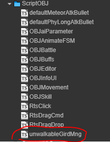

# 对象定位模块

该功能的作用是1，描述游戏对象在地图中的所处行列坐标及其2，对象所处位置是否禁止寻路（自己站住的位置，其他对象要绕着走）
- 

## 节点操作

- 界面 inspector 面板设置 isMakeGirdUnwalkable 可控制是否开启所处位置设置为禁止寻路功能
```ts
@property({
    tooltip: '对象是否占用行走体积（即对象所处的格子不能作为路径点）',
})
isMakeGirdUnwalkable: boolean = true;
```

- currentStayColRow 为对象当前所处的网格位置（此属性加上对象的设计所占区域，可以描述了当前对象在地图的何处）
```ts
currentStayColRow: cc.Vec2 = cc.Vec2.ZERO;
```

## 对外接口

- unlock() 开启功能（包括停止更新位置信息，清除已经标记的占据格子）
- lock() 关闭功能
- cleanUnwalkArea(gird: cc.Vec2) 传入一个点（应该是我刚刚占的点）。将所占据的格子，设置为能行走