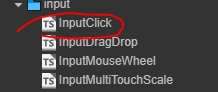

# 单击双击输入

该组件提供**单击双击**两个输入事件的注册和派发功能
- 脚本在哪
  - 

## 注册

- AddTap(callback: (e: cc.Event.EventTouch) => void, target)  单击
- AddDoubleTap(callback: (e: cc.Event.EventTouch) => void, target) 双击
  
## 派发

当对应逻辑触发则会派发事件
```ts
private onTouchEnd(e: cc.Event.EventTouch) {
    if (e.getTouches().length > 1) return;// 多点触碰认为是无效的点击
    this.ClickInfo.endTime = new Date().getTime();
    this.ClickInfo.endPos = e.getLocation();
    if (this.checkTap()) {
        if (this.checkDoubleTap()) {
            this.events.emit(CLICK_EVENT.DOUBLETAP, e);
        }
        this.events.emit(CLICK_EVENT.TAP, e);
        this.successTaoTouchInfo = this.ClickInfo;
    }
    e.stopPropagation();
}
```
- [什么是 CLICK_EVENT](../enum/CLICK_EVENT.md)

## 如何使用

- 首先要有一个 node 节点，节点上挂载该脚本。**注意** 挂载脚本的节点的 size 是点击的检测区域
- 然后你需要一个处理点击逻辑的脚本，脚本上向 InputClick 注册对应事件的回调。当点击事件触发对应回调里面处理点击逻辑
- 节点操作
  - 
- 代码逻辑
  - 