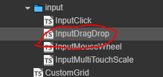
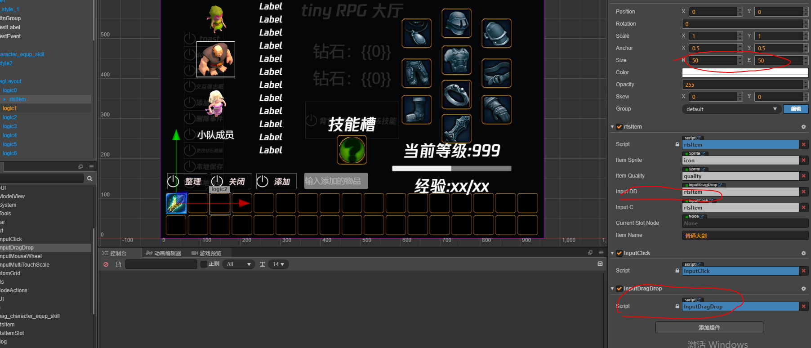
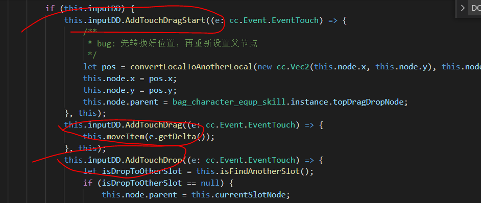

# 拖拽输入

该组件提供**拖拽**输入事件的注册和派发功能
- 脚本在哪
  - 

## 注册

```ts
public AddTouchStart(callback: (e: cc.Event.EventTouch) => void, target) {
    this.events.on(DRAG_DROP_EVENT.TouchStart, callback, target);
}
public AddTouchSMove(callback: (e: cc.Event.EventTouch) => void, target) {
    this.events.on(DRAG_DROP_EVENT.TouchMove, callback, target);
}
public AddTouchSEnd(callback: (e: cc.Event.EventTouch) => void, target) {
    this.events.on(DRAG_DROP_EVENT.TouchEnd, callback, target);
}
public AddTouchDrag(callback: (e: cc.Event.EventTouch) => void, target) {
    this.events.on(DRAG_DROP_EVENT.Drag, callback, target);
}
public AddTouchDrop(callback: (e: cc.Event.EventTouch) => void, target) {
    this.events.on(DRAG_DROP_EVENT.Drop, callback, target);
}
public AddTouchDragStart(callback: (e: cc.Event.EventTouch) => void, target) {
    this.events.on(DRAG_DROP_EVENT.DragStart, callback, target);
}
```

- [什么是 DRAG_DROP_EVENT](../enum/DRAG_DROP_EVENT.md)

## 如何使用

- 1，首先要有个 node ，node 挂载该脚本 **--注意--** 该节点不能是个 size 为 0，0 的节点
- 2，其次需要个处理拖拽逻辑的脚本，注册并处理拖拽事件的回调
- node 设置
  - 
- 逻辑处理代码
  - 