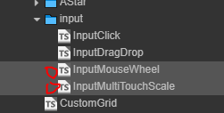

# 玩家输入

为什么不用引擎的输入接口，要单独再开发。因为引擎的触碰接口比较底层，对特定的输入手势处理不友好。就是不好用

## 单击，双击

项目中如何操作玩家点击动作
- [详细内容](InputClick.md)
  

## 拖拽

项目中如何操作玩家拖拽动作
- [详细内容](InputDragDrop.md)

下面两个和上面类似，用的少且更简单，偷懒不做描述了
- 

## 双指缩放

略略略

## 鼠标滚轮

略略略