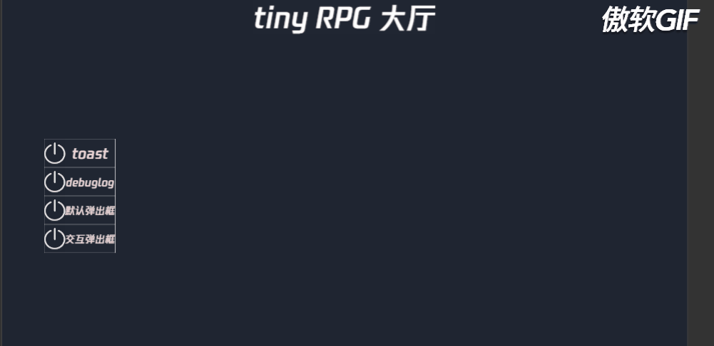

# 弹出式确认框

游戏中弹出一个供玩家点击的确认框。

## 简单示例

```ts
SystemPopUI.instance.showDialog('弹出框', '这是一个默认弹出框');
```
```ts
SystemPopUI.instance.showDialog('弹出框', '这是带交互的弹出框',
    quickCreateEventHandler(this.node, 'hallScene', 'onDialogCommit', 'close'),
    quickCreateEventHandler(this.node, 'hallScene', 'onDialogCommit', 'commit'),
    true,
    '关闭',
    '确认');
```

## 测试用例
- 用例
  - 调用接口
- 期望
  - 能正常弹出对话框且点击输入后正确调用回调函数
- 截图
  - 