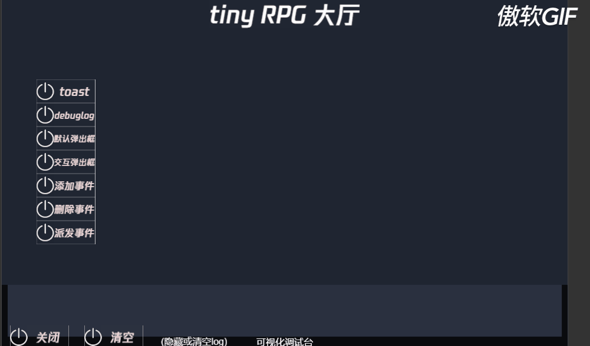

# 本地事件功能

本地事件功能提供了全局的事件响应包含，添加事件，移除事件，派发事件三个接口。允许客户端在任何脚本中使用事件

## 简单示例

```ts
// 注册
SystemEventCenter.instance.AddListener(EventType.TEST_EVENT, (sendData) => {
    // 函数中响应对应事件
}, this)
// 移除
SystemEventCenter.instance.RemoveListener(EventType.TEST_EVENT, this);
// 派发
SystemEventCenter.instance.DispatchEvent(EventType.TEST_EVENT, '派送事件携带的数据');
```
- **可能的疑惑** [EventType.TEST_EVENT 是什么？](./../enum/EventType.md) 
  
## 测试用例
- 用例
  - 注册事件
  - 派送事件
  - 移除事件
  - 派送事件
- 期望
  - 第一次派送应该响应事件，第二次派送不在响应事件
- 截图
  - 