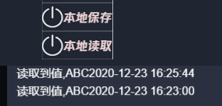

# 数据的本地持久化保存功能

creator 引擎已经开发了跨平台的数据存储功能，此处仅仅对该功能进行封装，功能没有变化。只是为了做到，管理存储的数据，知道存了些什么，不乱存，不乱取。

## 接口
- localStorageGet(key, type) 取数据
  - 通过输入的键值和数据类型，返回数据
- localStorageSet(key, type, value) 存数据
  - 将输入的值按键值和数据类型保存
- localStorageRemove(key) 删除
  - 按键值删除

- [什么是 key](../enum/localStorageMap.md)
- [什么是 type](../enum/localStorageDataType.md)

## 简单示例

- 例子1 读取 字符串
```ts
private OnReadLocalData(e, none) {
    let ret = localStorageGet(localStorageMap.testData, localStorageDataType.string);
    SystemDebugLog.instance.addInfo(logLve.whatEver, '读取到值,' + ret);
}
```
- 例子2 写入 字符串
```ts
private OnSaveLocalData(e, saveData) {
    localStorageSet(localStorageMap.testData, localStorageDataType.string, saveData + dateFormat());
}
```

- 