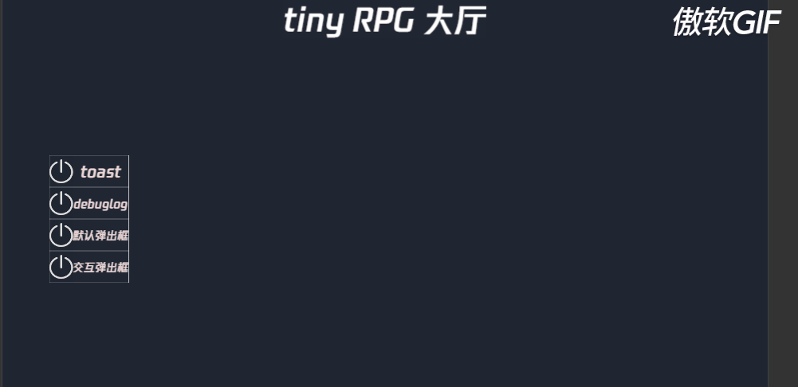

# 悬浮提示字符功能

悬浮提示可以在全局提供一个在屏幕上展示一段字符串再逐渐消失的接口，用来向用户提示有效的信息。

## 简单示例

```typescript
SystemToast.instance.showToast('需要输出的字符串');
```
## 测试用例

- 用例
  - 反复调用 **showToast** 接口
- 预期效果
  - 屏幕上依次显示输出内容且后输出的内容将先输入的内容向上顶
- 测试截图
  - 