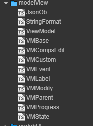
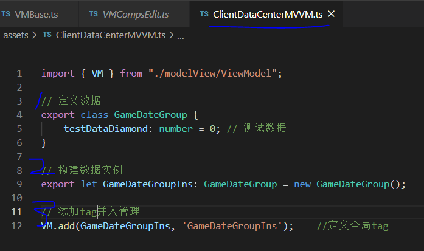
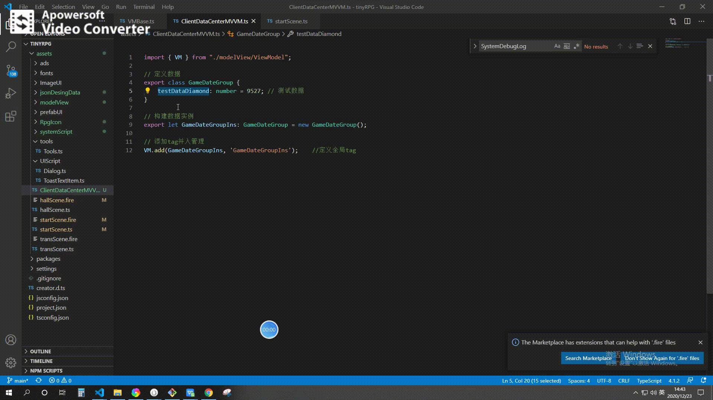
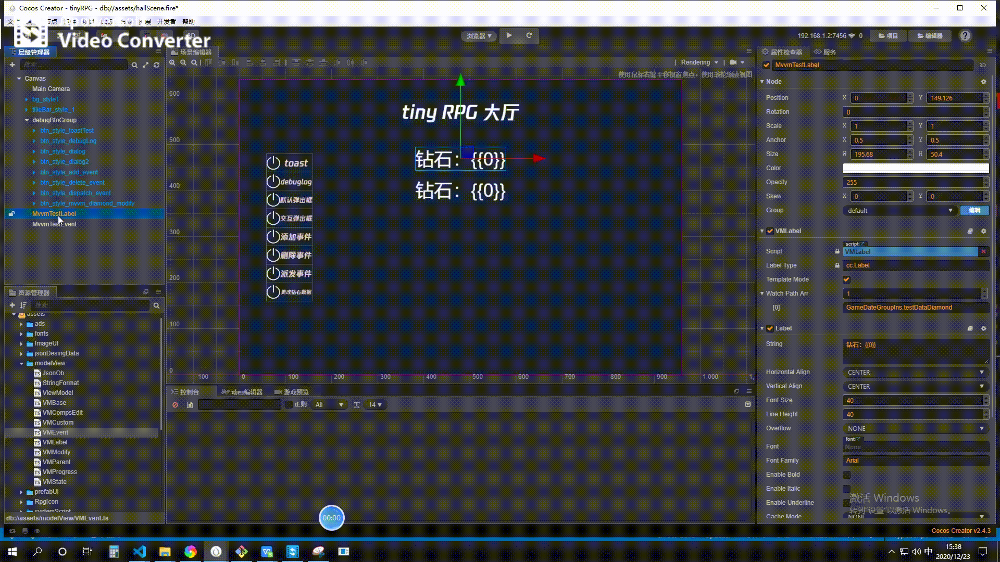

# mvvm 模块

**详细帮助文档**
- [mvvm(Model-View-ViewModel) 的解释](https://baike.baidu.com/item/MVVM/96310?fr=aladdin)
- [三方应用的说明文档](https://github.com/wsssheep/cocos_creator_mvvm_tools/blob/master/docs/MvvmInfo.md)

## 阅读上述文档能帮助你完全理解这个mvvm的作用，但是你肯定嫌上面两个文档又长又罗嗦，下面通过简单的示例来解释为什么要这个功能和这个功能的长处在哪里

### 开始使用

- 1，将插件源码文件夹复制到项目
  - 
- 2，定义一个管理数据的全局脚本文件
  - 

### 简单示例

- 总的来说这个插件的意义在于更优雅的管理**游戏数据**的**读****写**和**在界面上的展示**。
  - 例子1
    - 游戏内定义了 **钻石** 这一货币单位。现在需要在 UI 界面展示钻石的数量
    - 常规做法
      - 1，创建一个 label
      - 2，定义一个脚本，让脚本能够访问 label
      - 3，在脚本中设置 label 的 string 属性展示 **钻石** 字段
    - mvvm 做法
      - 1，创建一个 label
      - 2，添加 VMLabel 组件
      - 3，设置 VMLabel 的监听路径
      - 
- 你要问了，这好像也没怎么nb的，步骤也差不多。那么看接下来的例子
  - 例子2
    - 游戏内定义了 **钻石** 这一货币单位。现在需要在 UI 界面 **多个位置** 展示钻石的数量
    - 常规做法
      - 在 **例子1** 中的第三步让脚本持有多个 label 的引用，在代码中同时修改多个 label 的 string 属性
    - mvvm 做法
      - 看到这里你可以明白，在 mvvm 的操作方式是在新的label 中再次添加 VMLabel 组件，设置同样的监听路径即可

## 更进一步

对于数据的修改也可以是反向的，例子中是**钻石**的数值影响了UI界面的展示，UI界面的值变化了也可以影响数据中的变量；而且插件提供了多个 creator UI 组件的组件绑定脚本供使用，当然有时会有特别的需求无法满足。最后一个例子展示了当后台数值变化UI界面不只是简单的改写数值，而是需要做些额外操作的情况

- 例子3
  - 游戏内 **钻石** 变化了，需要改变所有UI界面钻石的数值之后，让 UI 晃动一下，提示用户注意
  - mvvm 做法
    - 1，首先要有脚本完成 **晃动一下** 一下的功能，这里由 ```UINodeActions``` 代劳
    - 2，按照**例子2**中设置好 VMLabel 和监听路径
    - 3，添加 VMEvent 组件，设置监听路径为**钻石**且将触发的回调函数设置为 ```UINodeActions``` 的 ```doPressAction```函数

- 综合所有例子的 mvvm 效果如下
  - 

## 更更进一步

老老实实的看完文档